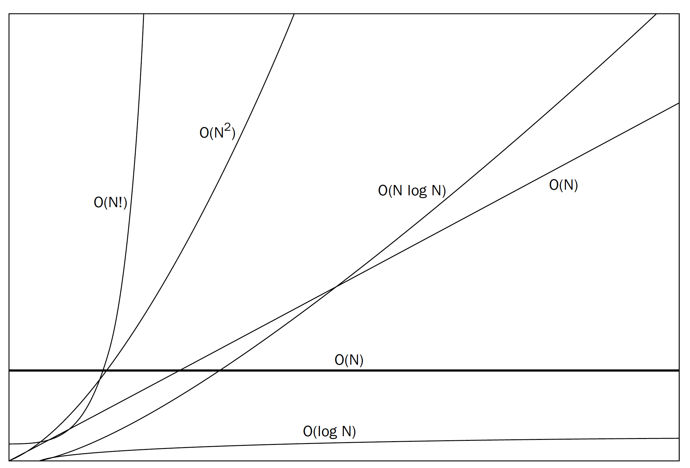
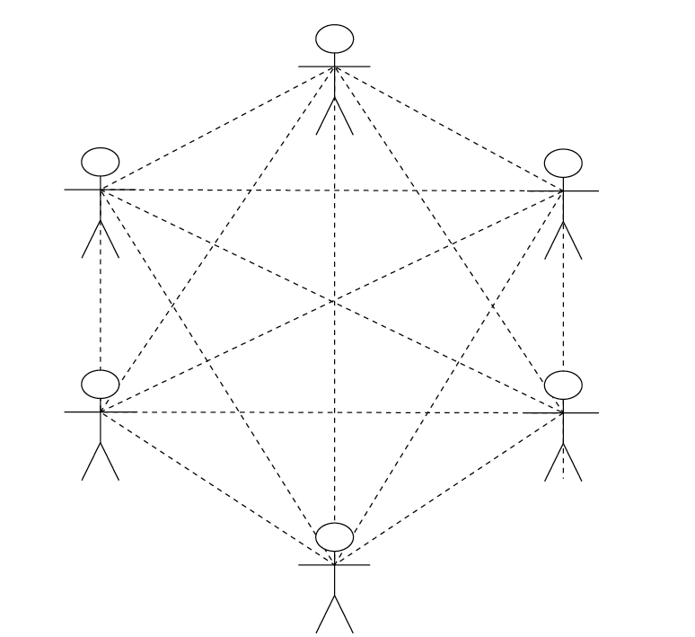

# What is Time Complexity

* It's important to have a precise vocabulary to talk about how our code performs
* Useful for discussing trade-offs between different approaches
* When your code slows down or crashes, identifying parts of the code that are inefficient can help us find pain points in our applications.


-

## Which is faster?

### A
```
int addUpTo(n){
   Int total = 0;
   for(int i = 0; i <=n; i++){
         total +=i;
   }
   return total;
}

```

### B
```
int addUpTo(n){
   return n * (n + 1) /2
}


```

_


### A
```
int addUpTo(n){
   Int total = 0;
   for(int i = 0; i <=n; i++){
         total +=i;
   }
   return total;
}

```

* N additions
* N assignments
* 1 assignment
* N comparisons 
* N additions 
* N assignments
* O(5N + 2) => O(N)

-

### B
```
int addUpTo(n){
   return n * (n + 1) /2
}
```

* 1 multiplication
* 1 addition
* 1 division
* O(3) => O(1)

-

### Big O Definition

* We say that an algorithm O(f(n)) if the number of simple operations the computer has to do is eventually less than a constant f(n), as n increases.
* f(n) could be linear (f(n) - n)
* f(n) could be quadratic (f(n) = n<sup>2</sup>)
* f(n) could be constant (f(n) = 1)

-

```
public void countUpAndDown(n){
	// O(n)
	for(int i =0; i < n ; i++){
		sout(i); 
	}
	//O(n)
	for(int j =0; j < n ; kj++){
		sout(j); 
	}
}
```
* The above even though this is O(2N) …. This is about fuzzy logic… we get rid of the constants and this becomes O(N)

-

```
public void countUpAndDown(n){
	//O(n)
	for( int i = 0 ; i < n; i++){
		// O(n)
		for(int j = 0 ; j < n ; j++){
			sout(j)
		}
	}

```

* The above even though this is O(N<sup>2</sup>) this is quadratic time!!

-

# Complexity

The complexity of an algorithm is defined in terms of order of magnitude of the number of operations required to perform a function, denoted by a capital O for order of - hence big-O - followed by an expression representing some growth relative to the size of the problem denoted by the letter N.

* O(1) - Order of 1 runs in constant time.
* O(N) - Order of N runs in linear time.
* O(N2) - Order of N squared runs in quadratic time
* O(logN) - Order log N runs in logarithmic time
* O(N log N) Order N log N ruins in time proportional to the size of the problem and logarithmic time.
* O(N!)  - order N factorial runs in factorial time.

-
# Complexity



-
# Complexity

The big thing to remember about big O notation is that, its not about the exact number of operations but rather to provide a means of comparing different algorithms for relative efficiency.

-

# Constant Time O(1)

* Constant time means that no matter how many items in the dataset , the number of operations performed will be the same. No matter if you have 1 element or 1000 the number of operations performed is exactly the same.
* Constant time doesn’t mean it will be the fastest algorithm , it just means that the algorithm will always take the same amount of time to complete.

-

# Linear Time: O(N)

* An algorithm runs in O(N) if the number of operations required to perform a function is directly proportional to the number of items being processed.
* Think of driving your car through a toll on the highway, on average it takes the same amount of time for each car to pass through. So the time it takes to move all the cars through the line is dependent on the number of cars. 
* So if each car takes 2 min to pass through, and you have 100 cars N = 100 => O(2N) => O(2 x 100) => O(200).
* Since this is O(2N) , we remove the constants because this isn’t about the exact number of operations, it’s just about the relative time it runs in so O(2N) becomes simply O(N).

-

# Quadratic Time: O(N<sup>2</sup>)
* This should be avoided for at all cost, and only used for the smallest of datasets!
* In the image below we have 6 people, let's imagine when these people meet , everyone shakes everyone's hand once. That equation would look like 5 + 4 + 3 + 2 + 1 = 15



* By adding one more person to the group you get 6 + 5 + 4 + 3 + 2 + 1 = 21
* Add one more and its 7 + 6 + 5 + 4 + 3 + 2 + 1 = 28

-

A nested for loop runs in O(N<sup>2</sup>), this is a horrible thing to do to the world…. DON'T DO IT!!


|  n | n<sup>2</sup>   |  n<sup>2</sup> - n  |  Difference |  
|---|---|---|---|
| 1  |1   | 0  |100.00%   |
| 10  |  100 | 90   | 10.00%  |  
| 100  | 10,000  | 9,900  |1.00%   |
| 1,000 |1,000,000, |999,000 | 0.10% |  
|10,000 | 1000,000,000| 99,990,000 | 0.01% |

_

# Logarithmic Time: O (log N) and O(N log N)

* So O(log N) is better than O(N) it is not better than O(1)
* The running time of a logarithmic algorithm increases with the log of the problem size.
* If you have a  data set of one million the run time will only increase log(1,000,000) = 20.

_

# Factorial Time : O(N!)

The Devil Made This

|  n | n<sup>2</sup>   |  N! |  
|---|---|---|
| 1 | 1 | 1|
| 1 | 4 | 2 |
| 3 | 9 | 6 |
| 4 | 16 |24 |
|5 | 25 | 120 |
| 6 | 36 | 720 |
| 7 | 49 | 5,040 |
| 8 | 64 | 40,320 |
| 9 | 81 | 362,880 |
| 10 | 100 | 3,628,800|

-
# DEMO


# More Links

* [Best Alogrithms Book](GA.pdf)
* [Big O The Basics](https://www.youtube.com/watch?v=v4cd1O4zkGw)
* [The Ultimate Big O Notation Tutorial (Time & Space Complexity For Algorithms)] (https://www.youtube.com/watch?v=waPQP2TDOGE&t=189s)
